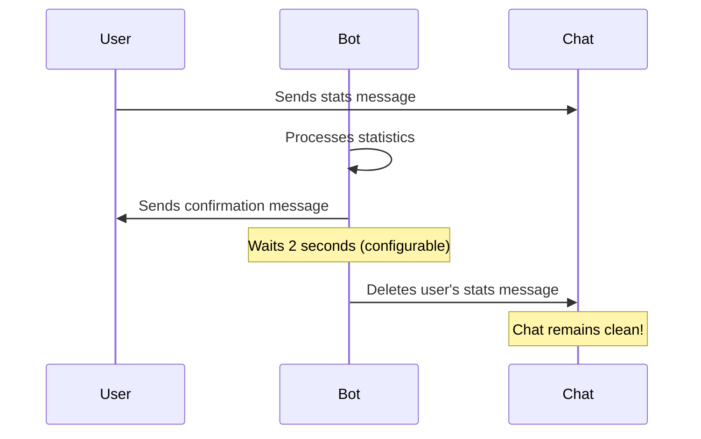

# Auto-Delete User Stats Messages Feature

## Overview

The **Auto-Delete Feature** automatically deletes users' stats messages after they have been successfully processed by the bot. This provides two major benefits:

1. **Keeps the chat clean** - No clutter from long statistics messages
2. **Prevents stat copying** - Other users cannot copy someone else's statistics (intentionally or accidentally)

## How It Works



## Configuration

### Environment Variables (.env file)

```bash
# Enable/disable auto-delete feature
AUTO_DELETE_USER_STATS=true

# Delay before deletion (in seconds)
# Default: 2 seconds - gives user time to see their message was received
AUTO_DELETE_DELAY_SECONDS=2
```

### Options

| Variable | Values | Default | Description |
|----------|--------|---------|-------------|
| `AUTO_DELETE_USER_STATS` | `true` / `false` | `true` | Enable or disable auto-delete |
| `AUTO_DELETE_DELAY_SECONDS` | Any integer (0-60) | `2` | Seconds to wait before deleting |

## Requirements

### ⚠️ IMPORTANT: Bot Admin Permissions

For this feature to work, the bot **MUST** have admin privileges in your group/channel with the following permission:

✅ **Delete Messages** - Required to remove user messages

### How to Grant Admin Permissions

#### For Telegram Groups:

1. Open your Telegram group
2. Go to **Group Info** → **Administrators**
3. Tap **Add Administrator**
4. Search for your bot username (e.g., `@ingressIN_leaderboard_bot`)
5. Grant the following permissions:
   - ✅ **Delete Messages**
   - _(Optional: other permissions your bot needs)_
6. Tap **Save**

#### For Telegram Channels:

1. Open your Telegram channel
2. Go to **Channel Info** → **Administrators**
3. Tap **Add Administrator**
4. Search for your bot
5. Grant **Delete Messages** permission
6. Tap **Save**

## Behavior

### When Auto-Delete is ENABLED (`AUTO_DELETE_USER_STATS=true`)

1. User sends stats message
2. Bot processes the statistics
3. Bot sends success confirmation
4. After delay (default 2 seconds), bot deletes the user's original message
5. Only the bot's confirmation remains visible

### When Auto-Delete is DISABLED (`AUTO_DELETE_USER_STATS=false`)

1. User sends stats message
2. Bot processes the statistics
3. Bot sends success confirmation
4. User's original message remains in the chat

## Error Handling

### If Bot Lacks Permissions

The bot will gracefully handle cases where it doesn't have delete permissions:

- **Processing continues normally** - Stats are still saved
- **Warning is logged** - Admin can see the issue in logs
- **No errors shown to user** - User experience is not disrupted

Example log message:
```
WARNING: Cannot delete message - bot needs admin privileges with 'delete messages' permission.
Chat: -1001234567890, User: 123456789
```

## Best Practices

### Recommended Settings

For **public groups** where stat privacy is important:
```bash
AUTO_DELETE_USER_STATS=true
AUTO_DELETE_DELAY_SECONDS=2
```

For **private groups** or **testing**:
```bash
AUTO_DELETE_USER_STATS=false
# No delay needed when disabled
```

### Delay Guidelines

| Delay | Use Case |
|-------|----------|
| `0 seconds` | Instant deletion - for very active chats |
| `2 seconds` | **Recommended** - User sees message was received |
| `5 seconds` | Slower networks - gives time for confirmation |
| `10+ seconds` | Not recommended - defeats the purpose |

## Privacy & Security Benefits

### 1. Prevents Stat Copying
- Users cannot copy each other's statistics
- Reduces confusion and accidental duplicates
- Maintains data integrity

### 2. Keeps Chat Clean
- No long statistics messages cluttering the chat
- Better user experience
- Easier to follow conversations

### 3. Encourages Participation
- Users feel their stats are private
- More likely to submit regularly
- Builds trust in the system

## Troubleshooting

### Problem: Messages are NOT being deleted

**Solution:**
1. Verify bot has admin privileges
2. Check bot has "Delete Messages" permission
3. Check `.env` file has `AUTO_DELETE_USER_STATS=true`
4. Check bot logs for permission errors

### Problem: Messages delete too fast

**Solution:**
Increase the delay in `.env`:
```bash
AUTO_DELETE_DELAY_SECONDS=5
```

### Problem: Want to disable auto-delete temporarily

**Solution:**
Update `.env`:
```bash
AUTO_DELETE_USER_STATS=false
```
Restart the bot for changes to take effect.

## Code Implementation

### Key Components

1. **Configuration** (`config/settings.py`):
   ```python
   AUTO_DELETE_USER_STATS = os.getenv("AUTO_DELETE_USER_STATS", "true").lower() == "true"
   AUTO_DELETE_DELAY_SECONDS = int(os.getenv("AUTO_DELETE_DELAY_SECONDS", "2"))
   ```

2. **Auto-Delete Method** (`src/handlers/message_handlers.py`):
   ```python
   async def _auto_delete_user_message(self, update: Update):
       """Auto-delete user's stats message to keep chat clean"""
       if not AUTO_DELETE_USER_STATS:
           return
       
       try:
           if AUTO_DELETE_DELAY_SECONDS > 0:
               await asyncio.sleep(AUTO_DELETE_DELAY_SECONDS)
           
           await update.message.delete()
           logger.info(f"Successfully deleted stats message")
       except BadRequest as e:
           logger.warning(f"Cannot delete message: {e}")
   ```

3. **Trigger** (after successful processing):
   ```python
   if success_count > 0:
       asyncio.create_task(self._auto_delete_user_message(update))
   ```

## FAQs

### Q: Will this work in private chats with the bot?
**A:** Yes, but it's less useful since only the user sees their own messages. The feature is designed primarily for groups.

### Q: Can users still see their submitted stats?
**A:** Yes! The bot sends a confirmation message showing what was submitted. Only the original message is deleted.

### Q: What if someone wants to keep their message?
**A:** They can screenshot before the delay expires, or you can disable the feature or increase the delay time.

### Q: Does this work for failed submissions?
**A:** No. Messages are only deleted after **successful** processing to avoid confusion.

### Q: Can I delete the bot's confirmation messages too?
**A:** Not with this feature. The confirmation messages are meant to stay as proof of submission.

## Summary

The Auto-Delete feature is a powerful tool for maintaining clean, organized leaderboard chats while protecting user privacy. Simply grant your bot admin permissions and enable the feature in your `.env` file!

---

**Need Help?** Check the logs for detailed error messages or open an issue on GitHub.